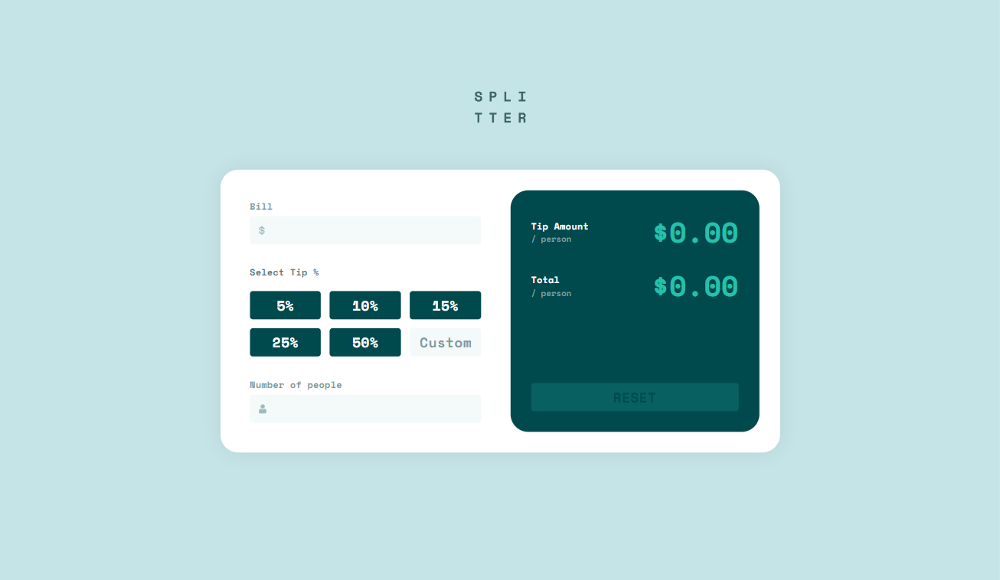
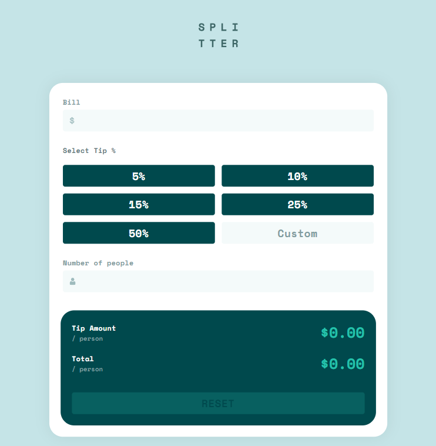
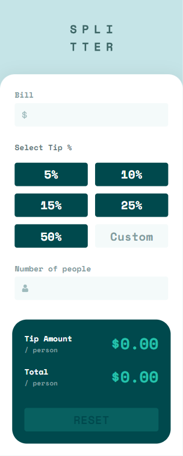

# Frontend Mentor - Tip calculator app solution

This is a solution to the [Tip calculator app challenge on Frontend Mentor](https://www.frontendmentor.io/challenges/tip-calculator-app-ugJNGbJUX). Frontend Mentor challenges help you improve your coding skills by building realistic projects.

## Table of contents

- [Overview](#overview)
  - [The challenge](#the-challenge)
  - [Screenshot](#screenshot)
  - [Links](#links)
  - [Built with](#built-with)

## Overview

### The challenge

Users should be able to:

- View the optimal layout for the app depending on their device's screen size
- See hover states for all interactive elements on the page
- Calculate the correct tip and total cost of the bill per person

### Screenshot

Desktop:

Tablet:

Mobile:

### Links

- Live Site URL: [https://dolir.github.io/tip-calculator-tw/](https://dolir.github.io/tip-calculator-tw/)

## My process

### Built with

- SCSS custom properties
- Custom SCSS color palette and mixins 
- Flexbox
- CSS Grid
- CSS modules
- Custom UI kit
- [React](https://reactjs.org/) - JS library
- Typescript
- CI/CD workflow with Git Actions and Git Pages

